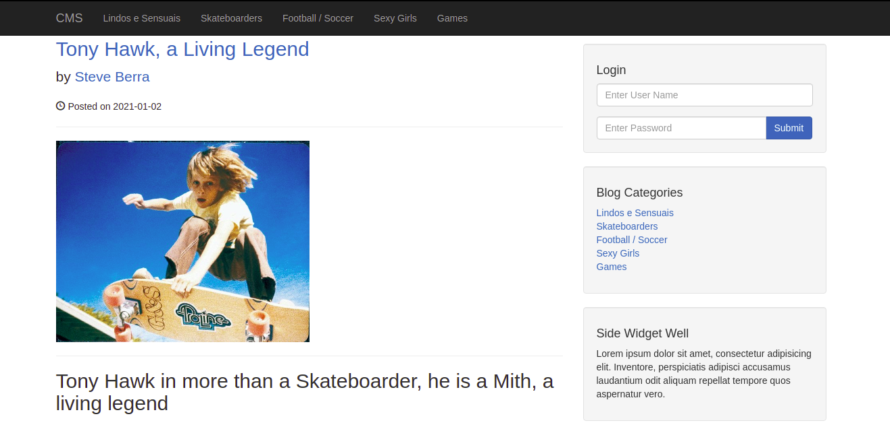

# CMS
A CMS project made using PHP with some BootStrap to help.
You can add, edit or delete posts and categories. 
Each post has a picture that is saved in a directory called images.
It is needed a password to log in as well as a username. 
The database is included as cms.sql.
You can also use the serach bar to find posts by name, tags or content.

