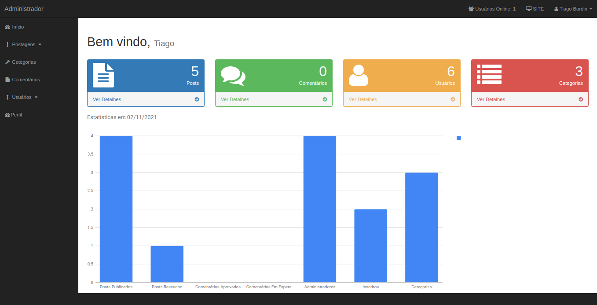
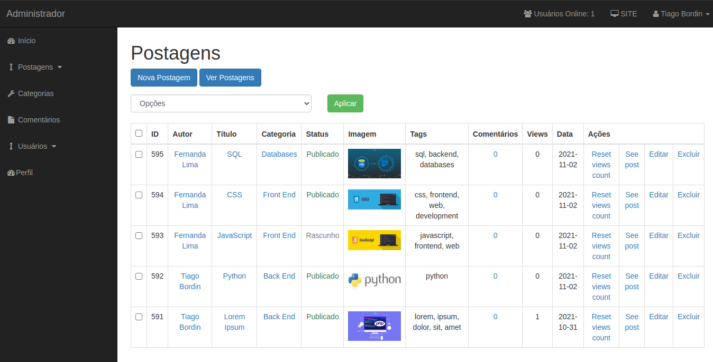

# CMS
A CMS project made using PHP with some BootStrap to help.

You can add, edit or delete posts and categories. 

Each post has a picture that is saved in a directory called images.
It is needed a password to log in as well as a username. 
The database is included as cms.sql.

You can also use the search bar to find posts by name, tags or content.

The admin area show how many admin users are logged in in real time usin Ajax

It is possible to create users, comments on front end and separate posts by categories.

# DATABASE
After create you data base just use the file **cms.sql** that contains the dump for create and populate your database

# CONNECTION
Use the file at **/includes/db_example.php** to build your connection
Create your connection in this file example and change the name to **db.php**
You can you use localhost or an online website

